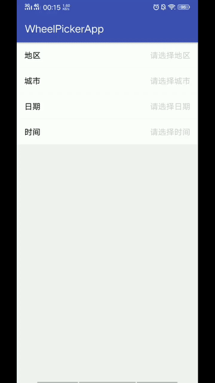

#  Android-WheelPicker

[](https://github.com/iTimeTraveler/Android-WheelPicker/blob/master/LICENSE)

A wheel view that uses a spinning-wheel or slot-machine metaphor to show one or more sets of values.（滚轮控件，时间选择器）



## Demo APK

[Download Demo Apk](preview/demo-debug.apk)

## Usage

Step 1. Add the dependency to `build.gradle`.

```groovy
dependencies {
  compile 'io.itimetraveler:pickerselector:0.0.0.2'
}
```

or download this repository.

Step 2. Add `WheelPicker` into your layouts or view hierarchy.

```xml
<io.itimetraveler.widget.picker.WheelPicker
    android:id="@+id/wheel_picker"
    android:layout_width="match_parent"
    android:layout_height="wrap_content" />
```

Step 3. fill it with a dataset.

```java
// demo dateset
List<String> mList = Arrays.asList("A", "B", "C");

mWheelPicker = (WheelPicker) findViewById(R.id.wheel_picker);
mWheelPicker.setOptions(new PicketOptions.Builder()
        .linkage(false)                                   // 是否联动
        .dividedEqually(false)                            // 每列宽度是否均等分
        .backgroundColor(Color.parseColor("#000000"))     // 背景颜色
        .dividerColor(Color.parseColor("#999999"))        // 选中项分割线颜色
        .build());

PickerAdapter adapter = new PickerAdapter() {
    @Override
    public int numberOfComponentsInWheelPicker(WheelPicker wheelPicker) {
        // 需要多少列
        return 2;
    }

    @Override
    public int numberOfRowsInComponent(int component) {
        // 某一列有多少行数据
        switch (component) {
            case 0:
                return 10;
            case 1:
                return mList.size();
        }
        return 0;
    }

    @Override
    public View onCreateView(ViewGroup parent, int row, int component) {
        // 某行某列显示的View，String 数据可使用默认 StringItemView 类
        String str = "";
        switch (component) {
            case 0:
                str = "" + row;
                break;
            case 1:
                str = mList.get(row);
                break;
        }
        return new StringItemView(String.valueOf(str)).onCreateView(parent);
    }

    @Override
    public void onBindView(ViewGroup parent, View convertView, int row, int component) {
        // 回收的View，仅需根据某行某列刷新数据。String 数据可使用默认 StringItemView 类
        String str = "";
        switch (component) {
            case 0:
                str = "" + row;
                break;
            case 1:
                str = mList.get(row);
                break;
        }
        new StringItemView(String.valueOf(str)).onBindView(parent, convertView, row);
    }
};
mWheelPicker.setAdapter(adapter);
mWheelPicker.setOnItemSelectedListener(new WheelPicker.OnItemSelectedListener() {
    @Override
    public void onItemSelected(WheelPicker parentView, int[] position) {
        // 选中后的回调
        s1 = "" + position[0];
        s2 = mList.get(position[1]);
        updateTextView();
    }
});
```
